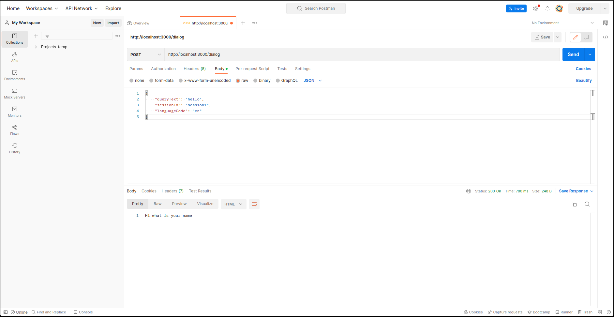
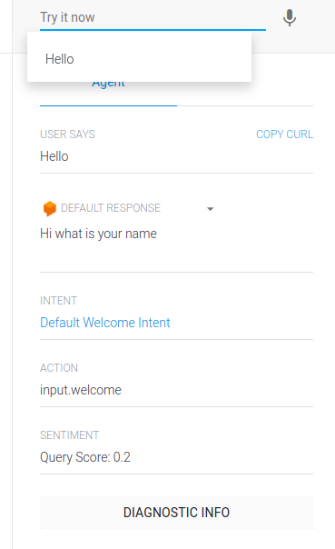

# Google Assitant POC


## Environment Variables

To run this project, you will need to add the following environment variables to your .env file

`API_KEY`

from `Dialogflow api services on google cloud`


## Deployment

To deploy this project run

```bash
  npm src/main.js
```
postman for post requests on `https://localhost:3000/dialog`

use rawn json as :

```
{
  "queryText": "<you query>"
  "sessionId": "<specified session id>"
  "languageCode": "<your language code>"
}
```


## Demo


